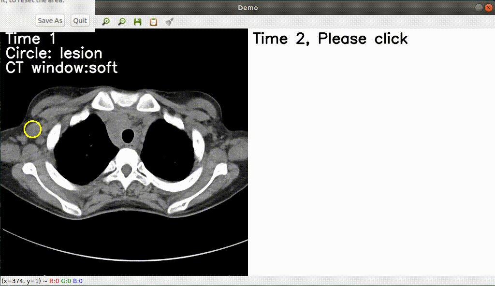

# Deep Lesion Tracker

For [DLT (CVPR2021)](https://arxiv.org/abs/2012.04872)  

Under construction...

 
> [**Deep Lesion Tracker: Monitoring Lesions in 4D Longitudinal Imaging Studies**](https://arxiv.org/abs/2012.04872)  
> Jinzheng Cai, Youbao Tang, Ke Yan, Adam P. Harrison, Jing Xiao, Gijin Lin, Le Lu  
> *will show in [CVPR2021](http://cvpr2021.thecvf.com/)*  

Contact: [caijinzhengcn@gmail.com](mailto:caijinzhengcn@gmail.com). Any questions or discussions are welcomed! 

## Updates

## Abstract  

## License

DLT is released under the [CC-BY-SA-4.0](https://choosealicense.com/licenses/cc-by-sa-4.0/#) License (refer to the LICENSE file for details).

## Citation

If you find this project useful for your research, please use the following BibTeX entry.

    @inproceedings{cai2020deep,
      title={Deep Lesion Tracker: Monitoring Lesions in 4D Longitudinal Imaging Studies}, 
      author={Jinzheng Cai and Youbao Tang and Ke Yan and Adam P. Harrison and Jing Xiao and Gigin Lin and Le Lu},
      booktitle={CVPR}, 
      year={2021}
    }